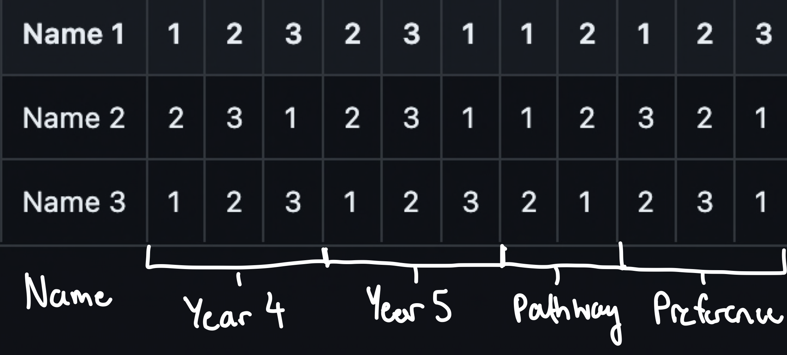

# une-placements

A simple script which assigns clinical schools and pathways to students based on their preferences.

## Adding Schools

Add a text file in csv format where the column ____ is ____
- 1: School Name
- 2: Capacity for Year 4
- 3: Capacity for Year 5
- 4: 'M' if Metro and 'R' if Rural

## Adding Pathways

Add a text file in csv format where the column ____ is ____
- 1: Pathway Name
- 2: Capacity for the Pathway

## Adding Students

Assuming there are n schools and m pathways

Add a text file in csv format where the column ____ is ____

- 1: Student Name
- 2 to n + 1: Ranks for Year 4 Schools
- n + 2 to 2n + 1: Ranks for Year 5 Schools
- 2n + 2 to 2n + m + 1: Ranks for Pathways
- 2n + m + 2 to 2n + m + 4: Rank for Year 4, Year 5, Pathway

For the example cohort in ```csv/students_ex```


The order of schools will match the order in the school file

The order of pathways will match the order of the pathway file

# Using the program

## Install the Packages

```pip install -r requirements.txt```

## Run the Program

```python3 placements.py [schools file] [students file]```

e.g.

```python3 -B placements.py csv/schools_ex csv/pathways_ex csv/students_ex```

## Current Constraints
- Every student gets assigned 1 school in Year 4, Year 5 and 1 Pathway
- At least 1 school must be metro
- A higher preference for pathways scales you down year 4 and year 5 etc.